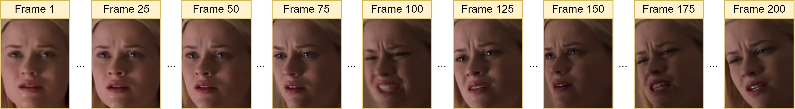

# Audio-Visual Compound Expression Recognition Method based on Late Modality Fusion and Rule-based Decision

This paper presents the results of the SUN team for the Compound Expression (CE) Recognition Challenge of the 6th ABAW Competition. We propose a novel audio-visual method for compound expression recognition. Our method relies on emotion recognition models that fuse modalities at the emotion probability level, while decisions regarding the prediction of compound expressions are based on predefined rules. Notably, our method does not use any training data specific to the target task. Thus, the problem is thus, a zero-shot classification task. The method is evaluated in multi-corpus training and cross-corpus validation setups. Our findings from the challenge demonstrate that the proposed method can potentially form a basis for developing intelligent tools for annotating audio-visual data in the context of human's basic and compound emotions.

Model weights are available at [models](https://drive.google.com/drive/folders/1KMkMNKkymTVV3eJaXHU6ydvEj5UfUA0E?usp=sharing). You should download them and place them in ``src/weights``. You will also need weights for the RetinaFace detection model. Please refer to the original [repository](https://github.com/hhj1897/face_detection).

To predict compound expression by a video, you should run the command:

```shell script
python src/run.py --path_video src/test_videos/20.mp4 --path_save src/test_videos/results/
```

Result of predictions obtained by static visual model (VS), dynamic visual model (VD) and audio model (A), and audio-visual modality fusion method:

<div style="display:flex; flex-direction: column;">
    
    
</div>
